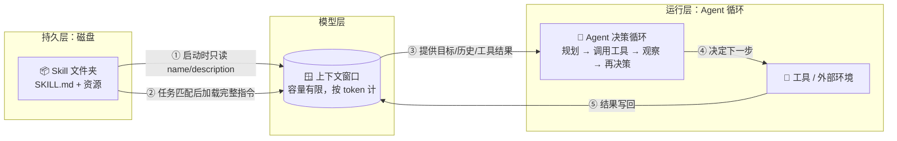
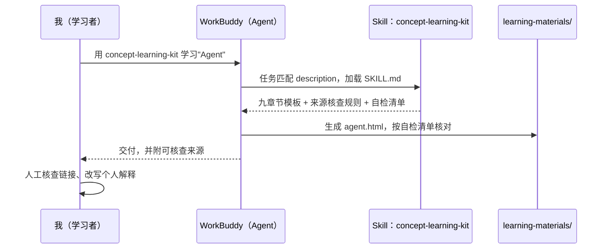

# 三个概念的关系：上下文 → Agent → Skill

本文件梳理本仓库三个概念之间的关系，重点回答两个问题：
1. **上下文如何影响 Agent 的工作**；
2. **Skill 如何沉淀可复用的任务知识**。

配套阅读：[agent.html](learning-materials/agent.html) · [llm-context.html](learning-materials/llm-context.html) · [skill.html](learning-materials/skill.html)

## 一、总览：一句话关系链

> **Agent 以上下文为"工作台"做出每一步决策；Skill 是预先写好、按需加载进上下文的"作业指导书"；三者通过上下文窗口连接成一个可执行、可复用的系统。**

## 二、三者角色对照表

| 概念 | 在系统中的角色 | 生命周期 | 存放位置 | 对应本仓库 |
|---|---|---|---|---|
| 大模型的上下文（Context） | Agent 每一步决策所依据的全部信息（工作台） | 单次请求内，会话结束即消失 | 模型调用时的输入 | ——（是另两者的"介质"） |
| Agent（智能体） | 自主决策与执行的循环（决策者 + 执行者） | 一次任务运行期间 | 应用/系统架构 | 本次作业的执行过程本身 |
| Skill（技能） | 沉淀下来的流程知识，约束和指导 Agent 的行为 | 长期，跨会话、跨任务复用 | 磁盘文件（`.workbuddy/skills/`） | `concept-learning-kit` |

## 三、整体关系图

读法：①② 是 Skill 进入系统的路径（渐进式披露）；③⑤ 是上下文与 Agent 的日常交互；④ 是 Agent 对外部的实际动作。

## 四、上下文如何影响 Agent 的工作

Agent 的"自主性"完全建立在上下文之上——模型只能基于窗口里的内容做决策，因此上下文的状态直接决定 Agent 的表现：

| 上下文状态 | 对 Agent 的影响 | 典型症状 | 应对手段 |
|---|---|---|---|
| 目标清晰、内容精炼 | 决策准确，工具选择得当 | —— | 把任务目标常驻系统提示 |
| 窗口接近填满 | 早期信息被挤出/裁剪 | 忘记最初目标、重复劳动 | 压缩旧观察为摘要 |
| 关键信息埋在中间 | 模型注意力衰减 | 明明给了资料却"没看见" | 重点前置或收尾（Lost in the Middle） |
| 噪声过多 | 注意力稀释 | 幻觉、跑题、选错工具 | 精选内容、用 RAG 替代整篇塞入 |
| 缺少流程知识 | 行为不稳定、每次做法不同 | 产出格式漂移 | 注入 Skill（见下一节） |

**一句话**：Agent 出错时，先检查的不是模型聪不聪明，而是上下文里"有什么、没什么、顺序对不对"。

## 五、Skill 如何沉淀可复用的任务知识

Skill 解决的是 Agent 的另一个根本问题：**模型很聪明，但它不知道"我们验证过的正确做法"**。

1. **知识外置**：把多步流程、格式规范、易错点写进 SKILL.md（自然语言 + 可选脚本），从"只在某人脑子里/某次对话里"变成仓库里可版本管理的文件；
2. **按需注入**：Agent 启动时只读每个 Skill 的 name 和 description（几十个 token），任务匹配后才加载完整指令——既有沉淀，又不挤占上下文；
3. **约束生成行为**：好的 Skill 自带核查规则（如本仓库 Skill 的"资料来源不得伪造、不得整段照搬"）和自检清单，把质量控制前移到生成阶段；
4. **可共享、可迭代**：Skill 随 Git 提交、diff、评审，团队每个成员（和每次 Agent 运行）都复用同一份改进过的流程知识。

## 六、本次作业中的三者协作实例

本次生成三份学习资料的过程，本身就是三个概念的闭环演示：

- **Skill** 提供流程知识（模板、来源要求、自检清单）；
- **Agent** 在运行时读取 Skill，围绕目标多步执行（生成 → 自检 → 修改）；
- **上下文** 承载了每一步：Skill 指令、已生成章节、自检结果——而它的容量限制，正是 Skill 要"渐进式披露"、长任务要"压缩历史"的原因。

三个概念由此咬合成一个整体：**Skill 把知识写进磁盘，上下文把知识带进模型，Agent 用这些知识把事情做完。**
